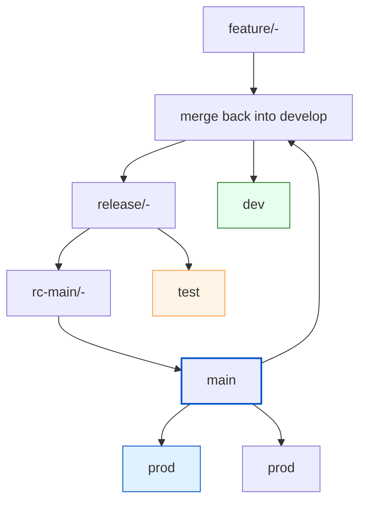

# Branching Strategy

Version: 1.0

Last updated: 2026-07-21

Purpose
-------

Document recommended Git branching practices for repositories that deploy to dev, test, and prod environments. The guidance balances simplicity, traceability, and safe deployments.

This is a living document and will be updated over time as new requirements and best practices are established.

Overview / Recommendation
-------------------------

Use an environment-aligned branching model with short-lived work branches for each stage and a protected production branch. This maps naturally to your dev/test/prod environments:

- `develop/<user>-<ticket>` — work branch deployed to the *dev* environment.
- `release/<user>-<ticket>` — test candidate branch deployed to the *test* environment.
- `rc-main/<user>-<ticket>` — production candidate branch promoted into `main` and deployed to the *prod* environment.



Branch Naming Conventions
-------------------------

- Dev branches: `develop/<user>-<ticket>` (examples: `develop/alice-1234`, `develop/bob-5678`).
- Test branches: `release/<user>-<ticket>` (examples: `release/alice-1234`, `release/bob-5678`).
- Prod candidate branches: `rc-main/<user>-<ticket>` (examples: `rc-main/alice-1234`, `rc-main/bob-5678`).
- Integration branch: `develop`.
- Production branch: `main` (use `main` as the protected prod branch).
- Hotfix branches: `hotfix/<ticket>` (example: `hotfix/4321-critical-fix`).

Workflow
--------

1. Developer work
   - Create a short-lived feature branch from `develop`: `git checkout -b feature/alice-1234 develop`.
   - Push and open a Merge/Pull Request (PR) targeting `develop` when ready: CI runs unit tests/lint.
   - Use small, focused PRs with descriptive titles and link to ticket IDs.

2. Integrate to dev
   - After reviews and passing CI, merge the PR into `develop` (use merge commit or squash per repo policy).
   - CI pipelines build artifacts and deploy `develop` to the *dev* environment for validation.

3. Prepare a release / RC for test
   - When the integration on `develop` is ready for QA, create a `release/*` or `rc/*` branch from `develop`.
     - Example: `git checkout -b release/v1.2.0 develop` or `git checkout -b rc/v1.2.0-rc1 develop`.
Use the release branch for final verification and bugfixes. Fixes can be committed to the release branch and, if needed, cherry-picked or merged back into `develop`.
- Deploy the release branch to the *test* environment.

4. Promote to production
- Once QA approves the release branch, create or update an `rc-main/<user>-<ticket>` branch from it, validate it, then merge `rc-main/<user>-<ticket>` into `main`.
   - Merge `main` back into `develop` to ensure bugfixes are included.
   - CI/CD deploys `main` to *prod* automatically after passing required checks.

5. Hotfixes
   - Create `hotfix/<ticket>` from `main`, apply fix, run tests, then merge back into `main` and `develop` (and tag). Deploy `main`.

Branch Protection and CI/CD
--------------------------

- Configure CI to deploy branches to corresponding environments automatically on merge or tag:
  - `develop` → deploy to *dev*
  - `release/*` / `rc-main/*` → deploy to *test*
  - `main` (tagged) → deploy to *prod*
- Require production deployments from `main` to be based on tags, allowing multiple production versions to be tracked and deployed from `main`.

GitLab CI/CD Example
--------------------

Use branch-specific job rules in `.gitlab-ci.yml` to map each branch pattern to the correct environment deployment.

```yaml
stages:
  - build
  - test
  - deploy

build:
  stage: build
  script:
    - echo "Build artifacts"
  rules:
    - if: '$CI_COMMIT_BRANCH =~ /^develop\//'
      when: always
    - if: '$CI_COMMIT_BRANCH =~ /^release\//'
      when: always
    - if: '$CI_COMMIT_BRANCH == "main"'
      when: always
    - when: never

unit_tests:
  stage: test
  script:
    - echo "Run tests"
  rules:
    - if: '$CI_COMMIT_BRANCH =~ /^develop\//'
      when: always
    - if: '$CI_COMMIT_BRANCH =~ /^release\//'
      when: always
    - if: '$CI_COMMIT_BRANCH == "main"'
      when: always
    - when: never

deploy_dev:
  stage: deploy
  script:
    - echo "Deploy to dev"
  environment:
    name: dev
  rules:
    - if: '$CI_COMMIT_BRANCH =~ /^develop\//'
      when: on_success
    - when: never

deploy_test:
  stage: deploy
  script:
    - echo "Deploy to test"
  environment:
    name: test
  rules:
    - if: '$CI_COMMIT_BRANCH =~ /^release\//'
      when: on_success
    - when: never

deploy_prod:
  stage: deploy
  script:
    - echo "Deploy to prod"
  environment:
    name: prod
  rules:
    - if: '$CI_COMMIT_BRANCH == "main"'
      when: on_success
    - when: never
```

Notes:

- Use `rules:` with branch patterns to control which jobs run for each branch type.
- Protect `main` and require manual approval or specific tags for production deploys if needed.
- If you want explicit `rc-main/*` validation before merging to `main`, add a separate review or deployment job that only runs for `rc-main/*`.

Versioning and Tags
--------------------

- Use semantic versioning for release branch naming and version metadata; tag `main` for production with the format `main-V<date>-versionNumberForThatDay`.
- Example: `git tag -a main-V20260722-01 -m "Release main-V20260722-01"`.
- Require production deployments from `main` to be based on this tag format so multiple versions of `main` can be traced independently.
- Keep release notes in a `CHANGELOG.md` or generated from PRs.

Creating Tags in GitLab UI
--------------------------

1. Open the project in GitLab.
2. Navigate to `Repository` > `Tags`.
3. Click `New tag`.
4. Enter the tag name using the format `main-V<date>-versionNumberForThatDay`.
5. For `Create from`, select the `main` branch or the branch you are tagging.
6. Add a descriptive message, for example `Release main-V20260722-01`.
7. Click `Create tag`.

Examples
--------

Feature workflow example:

```bash
# Start a feature
git checkout develop
git checkout -b feature/alice-1234
# work, commit
git push -u origin feature/alice-1234
# Open PR -> target: develop
```

Release workflow example:

```bash
# Create release candidate from develop
git checkout develop
git checkout -b release/v1.2.0
git push -u origin release/v1.2.0
# Deploy release/v1.2.0 to test for QA
# After QA, merge into main and tag
git checkout main
git merge --no-ff release/v1.2.0
git tag -a main-V20260722-01 -m "Release main-V20260722-01"
git push origin main --tags
# Merge main back into develop
git checkout develop
git merge main
git push origin develop
```

Hotfix example:

```bash
git checkout main
git checkout -b hotfix/4321-critical-fix
# fix + commit
git push -u origin hotfix/4321-critical-fix
# PR to main (and merge to develop afterwards)
```

Guidelines and Best Practices
-----------------------------

- Keep feature branches short-lived (days to a couple weeks). Rebase or merge frequently from `develop` to reduce conflicts.
- Prefer small, focused PRs for easier review and faster feedback.
- Automate checks: tests, static analysis, security scans, and artifact builds.
- Use feature flags for risky features that need toggling in production without deploying separate branches.
- Capture deployment metadata (branch, commit, tag) in your CI/CD pipelines for traceability.
- Ensure branch freshness before merge: update the source branch if it is behind the target branch.

