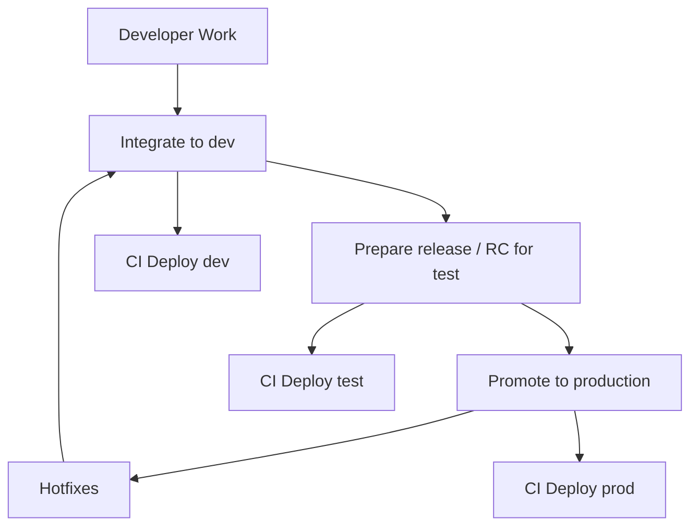

# Merge Request Process

Version: 1.0

Last updated: 2026-07-22

Purpose
-------

Document merge request (MR) and pull request (PR) guidance, approvals, branch protection, CI/CD triggers, and merge-readiness requirements for the engineering handbook repository.

This is a living document and will be updated over time as new requirements and best practices are established.

Workflow
--------



1. Developer work
   - Create a short-lived feature branch from `develop`: `git checkout -b feature/alice-1234 develop`.
   - Push and open a Merge/Pull Request (PR) targeting `develop` when ready: CI runs unit tests/lint.
   - Use small, focused PRs with descriptive titles and link to ticket IDs.

2. Integrate to dev
   - After reviews and passing CI, merge the PR into `develop` (use merge commit or squash per repo policy).
   - CI pipelines build artifacts and deploy `develop` to the *dev* environment for validation.

3. Prepare a release / RC for test
   - When the integration on `develop` is ready for QA, create a `release/*` or `rc/*` branch from `develop`.
     - Example: `git checkout -b release/v1.2.0 develop` or `git checkout -b rc/v1.2.0-rc1 develop`.
   - **Update Terraform versions to the latest version that works with your environment.** Review [Terraform-Standards.md](Terraform-Standards.md) for version management and update all IaC to current stable versions compatible with your infrastructure APIs and constraints. *Note: Government and regulated environments may be behind on API versions; verify compatibility with your target environment before committing to a new version.*
   - Use the release branch for final verification and bugfixes. Fixes can be committed to the release branch and, if needed, cherry-picked or merged back into `develop`.
   - Deploy the release branch to the *test* environment.

4. Promote to production
   - Once QA approves the release branch, create or update an `rc-main/<user>-<ticket>` branch from it, validate it, then merge `rc-main/<user>-<ticket>` into `main`.
   - Merge `main` back into `develop` to ensure bugfixes are included.
   - CI/CD deploys `main` to *prod* automatically after passing required checks.

5. Hotfixes
   - Create `hotfix/<ticket>` from `main`, apply fix, run tests, then merge back into `main` and `develop` (and tag). Deploy `main`.

PR and Review Policies
----------------------

- Require at least one reviewer for PRs merged into `develop`.
- Require two approvals for PRs merged into `release/*`, including approval from the Test Manager.
- Require three approvals for PRs merged into `main`, including approvals from Cyber, Architecture, and Operations.
- Do not approve or merge MRs that show the branch is behind the target branch.
- Before merging, the source branch should be rebased onto the target branch or the target branch should be merged into the source branch so the MR is up to date.
- Require passing CI checks (unit tests, PSScriptAnalyzer, lint, security scans) before merging.
- Use descriptive PR templates that include environment impact, migration steps, and rollback guidance.

Branch Protection and CI/CD
--------------------------

- Protect `develop`, `release/*`, `rc-main/*`, and `main` branches with rules:
  - `develop` requires at least one approval.
  - `release/*` requires two approvals, including the Test Manager.
  - `rc-main/*` requires two approvals, including the Test Manager before promoting to `main`.
  - `main` requires three approvals: Cyber, Architecture, and Operations.
  - Require status checks to pass.
  - Restrict who can push/merge to protected branches.
- Configure CI to deploy branches to corresponding environments automatically on merge or tag:
  - `develop` → deploy to *dev*
  - `release/*` / `rc-main/*` → deploy to *test*
  - `main` (tagged) → deploy to *prod*
- Require production deployments from `main` to be based on tags using the format `main-V<date>-versionNumberForThatDay`, supporting multiple main versions and traceable production releases.

GitLab CI/CD Example
--------------------

Use branch-specific job rules in `.gitlab-ci.yml` to map each branch pattern to the correct environment deployment.

```yaml
stages:
  - build
  - test
  - deploy

build:
  stage: build
  script:
    - echo "Build artifacts"
  rules:
    - if: '$CI_COMMIT_BRANCH =~ /^develop\//'
      when: always
    - if: '$CI_COMMIT_BRANCH =~ /^release\//'
      when: always
    - if: '$CI_COMMIT_BRANCH == "main"'
      when: always
    - when: never

unit_tests:
  stage: test
  script:
    - echo "Run tests"
  rules:
    - if: '$CI_COMMIT_BRANCH =~ /^develop\//'
      when: always
    - if: '$CI_COMMIT_BRANCH =~ /^release\//'
      when: always
    - if: '$CI_COMMIT_BRANCH == "main"'
      when: always
    - when: never

deploy_dev:
  stage: deploy
  script:
    - echo "Deploy to dev"
  environment:
    name: dev
  rules:
    - if: '$CI_COMMIT_BRANCH =~ /^develop\//'
      when: on_success
    - when: never

deploy_test:
  stage: deploy
  script:
    - echo "Deploy to test"
  environment:
    name: test
  rules:
    - if: '$CI_COMMIT_BRANCH =~ /^release\//'
      when: on_success
    - when: never

deploy_prod:
  stage: deploy
  script:
    - echo "Deploy to prod"
  environment:
    name: prod
  rules:
    - if: '$CI_COMMIT_BRANCH == "main"'
      when: on_success
    - when: never
```

Notes:

- Use `rules:` with branch patterns to control which jobs run for each branch type.
- Protect `main` and require manual approval or specific tags for production deploys if needed.
- If you want explicit `rc-main/*` validation before merging to `main`, add a separate review or deployment job that only runs for `rc-main/*`.

Merge Readiness Checklist
-------------------------

- [ ] Branch is up to date with the target branch and shows no commits behind.
- [ ] Required approvals are present for the target environment (`develop`, `release/*`, `main`).
- [ ] All required CI checks and automated tests are passing.
- [ ] PR description includes environment impact, rollback guidance, and ticket references.

MR Template
-----------

A GitLab MR template exists at `.gitlab/merge_request_templates/Default.md` and includes an environment impact checklist item.
